# SportReserve

## Sistema de Gestión de Reservas y Control de Acceso para Escenarios Deportivos

### Johana Catalina Gaviria Moncayo - Julian Pedroza Ospina

---

## 1. Descripción del proyecto

**SportReserve** es un sistema orientado a objetos para la gestión de reservas de escenarios deportivos.

El sistema permitirá registrar personas, escenarios deportivos y reservas. Cada reserva tendrá un **responsable**, una lista de **jugadores** y una lista de **espectadores**.

Además, el sistema permitirá gestionar el pago de una reserva mediante un **anticipo** o un **pago total**, calcular automáticamente el saldo pendiente y controlar el ingreso de las personas al escenario.

Una de las funcionalidades principales será validar que las personas que ingresen al área deportiva sean realmente las personas registradas como **jugadores**, evitando que una persona registrada únicamente como espectador pueda utilizar el escenario como jugador.

---

## 2. Problema

Una reserva deportiva normalmente no debería limitarse a registrar únicamente a la persona que realiza la reserva.

Por ejemplo, una persona puede reservar una cancha de microfútbol para las 6:00 PM y ser responsable de un grupo de 10 jugadores.

El sistema debe permitir identificar:

- Quién realizó la reserva.
- Qué escenario fue reservado.
- Qué personas son jugadores.
- Qué personas son espectadores.
- Cuántos jugadores están registrados.
- Cuál es la capacidad máxima del escenario.
- Quiénes ingresaron realmente.
- Cuánto dinero se ha pagado.
- Cuánto dinero queda pendiente.
- Si la persona que intenta ingresar está autorizada como jugador.

---

## 3. Objetivo general

Desarrollar un sistema orientado a objetos que permita gestionar reservas de escenarios deportivos, responsables, jugadores, espectadores, pagos y control de acceso.

---

## 4. Objetivos específicos

- Registrar y administrar personas.
- Registrar escenarios deportivos.
- Definir la capacidad máxima de jugadores.
- Crear reservas para fechas y horarios determinados.
- Asignar un responsable a cada reserva.
- Registrar jugadores.
- Registrar espectadores.
- Validar la capacidad máxima de jugadores.
- Evitar jugadores duplicados.
- Validar la disponibilidad del escenario.
- Registrar el ingreso de los jugadores.
- Diferenciar jugadores de espectadores.
- Validar el rol de una persona al ingresar.
- Registrar anticipos.
- Registrar pagos totales.
- Calcular el saldo pendiente.
- Manejar excepciones personalizadas.
- Aplicar principios SOLID.
- Aplicar patrones de diseño.
- Aplicar conceptos de Programación Orientada a Objetos.

---

## 5. Alcance del sistema

### 5.1 Gestión de personas

El sistema permitirá:

- Registrar personas.
- Consultar personas.
- Actualizar información.
- Buscar personas por documento.
- Validar que una persona esté registrada.

Una misma persona puede participar en diferentes reservas y tener diferentes roles dependiendo de la reserva.

Ejemplo:

```text
Juan Pérez

Reserva #001 → JUGADOR
Reserva #002 → ESPECTADOR
Reserva #003 → JUGADOR
```

---

## 6. Escenarios deportivos

El sistema podrá administrar diferentes escenarios:

- Fútbol.
- Microfútbol.
- Baloncesto.
- Voleibol.

Cada escenario tendrá una capacidad máxima de jugadores.

Ejemplo:

```text
Cancha Microfútbol #1

Capacidad máxima:
10 jugadores
```

La capacidad deportiva contará únicamente a los **jugadores**.

Los espectadores no ocuparán espacios de la capacidad deportiva.

---

## 7. Reserva

Una reserva estará compuesta por:

```text
Reserva
│
├── Responsable
├── Escenario
├── Fecha
├── Hora de inicio
├── Hora de finalización
├── Estado
├── Jugadores
├── Espectadores
└── Pago
```

Ejemplo:

```text
=================================================
                RESERVA #001
=================================================

Responsable:
Juan Pérez

Escenario:
Cancha Microfútbol #1

Fecha:
30/09/2026

Horario:
18:00 - 20:00

Estado:
CONFIRMADA

Jugadores:
10

Espectadores:
3

Valor:
$100.000

Pago:
Anticipo $50.000

Saldo:
$50.000
```

---

## 8. Responsable de la reserva

Toda reserva debe tener un responsable.

El responsable es la persona encargada de realizar y administrar la reserva.

Sin embargo:

> El responsable no necesariamente tiene que ser jugador.

Ejemplo:

```text
Responsable:
Juan Pérez

Rol:
ESPECTADOR
```

En este caso Juan realizó la reserva pero no jugará.

También puede ocurrir:

```text
Responsable:
Juan Pérez

Rol:
JUGADOR
```

En este caso Juan realiza la reserva y además participa en el partido.

---

## 9. Jugadores y espectadores

Una reserva tendrá personas asociadas mediante la clase:

```text
ParticipacionReserva
```

Cada participación tendrá un rol:

```java
public enum RolParticipacion {

    JUGADOR,
    ESPECTADOR
}
```

Ejemplo:

```text
RESERVA #001

JUGADORES

1. Juan Pérez
2. Carlos López
3. Pedro Gómez
4. Andrés Martínez
5. Luis Rodríguez
6. Miguel Torres
7. Daniel Muñoz
8. Sebastián Díaz
9. Mateo Vargas
10. Nicolás Castillo


ESPECTADORES

1. Laura Pérez
2. María Gómez
3. David Rodríguez
```

---

## 10. Regla de capacidad

La capacidad máxima del escenario se aplicará únicamente a los jugadores.

Ejemplo:

```text
Cancha Microfútbol #1

Capacidad:
10 jugadores

Jugadores registrados:
10

Espectadores:
5
```

La reserva es válida porque existen exactamente 10 jugadores.

Los espectadores no afectan la capacidad deportiva.

Si se intenta agregar un jugador número 11:

```text
Capacidad: 10
Jugadores: 11
```

El sistema deberá lanzar:

```text
CapacidadJugadoresExcedidaException
```

---

## 11. Control de acceso

Una de las principales funcionalidades será controlar quién puede utilizar el escenario.

Cuando una persona llegue, el sistema podrá buscarla mediante su documento.

Ejemplo:

```text
Documento:
1085001234
```

El sistema encuentra:

```text
Persona:
Carlos López

Reserva:
#001

Rol:
JUGADOR

Estado:
REGISTRADO
```

Resultado:

```text
ACCESO PERMITIDO AL ÁREA DEPORTIVA
```

### 11.1 Persona registrada como espectador

Si la persona está registrada como espectador:

```text
Persona:
Laura Pérez

Reserva:
#001

Rol:
ESPECTADOR
```

Resultado:

```text
ACCESO AL ÁREA DEPORTIVA DENEGADO

La persona está registrada como espectador.
```

La persona podría ingresar al área destinada a espectadores si el establecimiento lo permite, pero no podrá utilizar la cancha como jugador.

### 11.2 Persona que no está registrada

Si una persona no pertenece a la reserva:

```text
Persona:
Pedro Ramírez
```

Resultado:

```text
PERSONA NO REGISTRADA EN LA RESERVA
```

El sistema generará una excepción.

---

## 12. Estado de ingreso

Cada participación podrá controlar si la persona realmente ingresó.

```java
public enum EstadoIngreso {

    REGISTRADO,
    INGRESO,
    NO_INGRESO
}
```

Ejemplo:

```text
Juan Pérez       → INGRESO
Carlos López     → INGRESO
Pedro Gómez      → INGRESO
Andrés Martínez  → NO_INGRESO
Luis Rodríguez   → REGISTRADO
```

Esto permite diferenciar entre:

- Personas registradas.
- Personas que ingresaron.
- Personas que no ingresaron.

---

## 13. Clase ParticipacionReserva

La clase `ParticipacionReserva` representa la participación de una persona específica dentro de una reserva.

```java
public class ParticipacionReserva {

    private Persona persona;
    private RolParticipacion rol;
    private EstadoIngreso estadoIngreso;
    private LocalDateTime horaIngreso;

    public void registrarIngreso() {
        this.estadoIngreso = EstadoIngreso.INGRESO;
        this.horaIngreso = LocalDateTime.now();
    }

    public boolean esJugador() {
        return rol == RolParticipacion.JUGADOR;
    }

    public boolean esEspectador() {
        return rol == RolParticipacion.ESPECTADOR;
    }
}
```

Esto permite que una misma persona tenga diferentes roles en diferentes reservas.

---

## 14. Pago de la reserva

El sistema permitirá dos modalidades principales:

```text
ANTICIPO
PAGO_TOTAL
```

### 14.1 Anticipo

El cliente paga solamente una parte del valor de la reserva.

Ejemplo:

```text
Valor de la reserva:
$100.000

Anticipo:
$50.000

Saldo pendiente:
$50.000
```

### 14.2 Pago total

El cliente paga el valor completo.

```text
Valor de la reserva:
$100.000

Pago:
$100.000

Saldo pendiente:
$0
```

---

## 15. Modalidad de pago

```java
public enum ModalidadPago {

    ANTICIPO,
    PAGO_TOTAL
}
```

---

## 16. Estado del pago

```java
public enum EstadoPago {

    PENDIENTE,
    ANTICIPO,
    PAGADO
}
```

---

## 17. Método de pago

La modalidad y el método de pago serán conceptos diferentes.

### Modalidad

```text
ANTICIPO
PAGO_TOTAL
```

### Método

```text
EFECTIVO
TARJETA
NEQUI
TRANSFERENCIA
```

Esto permite:

```text
Anticipo + Nequi

Pago total + Tarjeta

Anticipo + Efectivo

Pago total + Transferencia
```

---

## 18. Clase Pago

```java
public class Pago {

    private double valorReserva;
    private double valorPagado;
    private double saldoPendiente;

    private ModalidadPago modalidad;
    private MetodoPago metodo;
    private EstadoPago estado;

    public void registrarPago(double valor) {

        this.valorPagado += valor;

        this.saldoPendiente =
            this.valorReserva - this.valorPagado;
    }

    public boolean estaPagado() {
        return saldoPendiente == 0;
    }
}
```

---

## 19. Strategy Pattern

El patrón **Strategy** será utilizado para manejar los diferentes métodos de pago.

```java
public interface MetodoPago {

    void pagar(double valor);
}
```

Implementaciones:

```text
MetodoPago
    |
    +-- PagoEfectivo
    +-- PagoNequi
    +-- PagoTarjeta
    +-- PagoTransferencia
```

Ejemplo:

```java
MetodoPago metodoPago = new PagoNequi();

metodoPago.pagar(50000);
```

### Beneficio

Permite cambiar el método de pago sin modificar la lógica principal de la reserva.

---

## 20. Factory Pattern

El patrón **Factory** podrá utilizarse para crear los diferentes tipos de escenarios.

```text
EscenarioFactory

    |
    +-- Fútbol
    +-- Microfútbol
    +-- Baloncesto
    +-- Voleibol
```

Ejemplo:

```java
Escenario escenario =
    EscenarioFactory.crear(
        TipoEscenario.MICROFUTBOL
    );
```

### Beneficio

Centraliza la creación de los escenarios.

---

## 21. Repository Pattern

El patrón **Repository** permitirá separar la lógica de negocio del almacenamiento.

Interfaces:

```text
ReservaRepository
PersonaRepository
EscenarioRepository
```

Inicialmente:

```text
ReservaRepositoryMemoria
PersonaRepositoryMemoria
EscenarioRepositoryMemoria
```

Posteriormente:

```text
ReservaRepositorySQL
PersonaRepositorySQL
EscenarioRepositorySQL
```

### Beneficio

Permite cambiar el mecanismo de almacenamiento sin modificar la lógica principal del sistema.

---

## 22. Observer Pattern

El patrón **Observer** podrá utilizarse para notificar eventos importantes.

Ejemplo:

```text
Reserva creada
      |
      +----> Notificación al responsable
      |
      +----> Registro del evento
```

También podrá utilizarse cuando:

- Se confirme una reserva.
- Se cancele una reserva.
- Se registre un pago.
- Se modifique el horario.

Este patrón será opcional dependiendo del alcance final.

---

## 23. Principios SOLID

### S - Single Responsibility Principle

Cada clase tendrá una responsabilidad específica.

```text
Persona
    → Datos de una persona.

Reserva
    → Datos y comportamiento principal de una reserva.

ReservaService
    → Lógica de negocio relacionada con reservas.

Pago
    → Información y comportamiento del pago.

ReservaRepository
    → Almacenamiento de reservas.
```

### O - Open/Closed Principle

El sistema podrá extenderse sin modificar las implementaciones existentes.

Ejemplo:

Actualmente:

```text
MetodoPago
    |
    +-- PagoEfectivo
    +-- PagoNequi
    +-- PagoTarjeta
    +-- PagoTransferencia
```

Posteriormente se podría agregar:

```text
PagoPSE
```

sin modificar las clases existentes.

### L - Liskov Substitution Principle

Las clases derivadas deberán poder utilizarse donde se espera el tipo base.

```text
Escenario
   |
   +-- CanchaFutbol
   +-- CanchaMicrofutbol
   +-- CanchaBaloncesto
   +-- CanchaVoleibol
```

Cualquier escenario concreto debe poder utilizarse mediante la referencia `Escenario`.

### I - Interface Segregation Principle

Las interfaces serán pequeñas y específicas.

Ejemplo:

```text
MetodoPago
ReservaRepository
PersonaRepository
EscenarioRepository
```

No se creará una interfaz gigante con métodos que las clases no necesitan.

### D - Dependency Inversion Principle

Los servicios dependerán de abstracciones.

```java
public class ReservaService {

    private final ReservaRepository repository;

    public ReservaService(
        ReservaRepository repository
    ) {
        this.repository = repository;
    }
}
```

`ReservaService` depende de la abstracción `ReservaRepository` y no directamente de una implementación concreta.

---

## 24. Excepciones personalizadas

El sistema utilizará excepciones para representar errores relacionados con las reglas del negocio.

### PersonaNoEncontradaException

Se genera cuando una persona no está registrada.

### ReservaNoDisponibleException

Se genera cuando el escenario ya está reservado para el horario seleccionado.

### CapacidadJugadoresExcedidaException

Se genera cuando se supera la capacidad máxima de jugadores.

### ParticipanteDuplicadoException

Se genera cuando una persona ya está registrada en la reserva.

### HorarioInvalidoException

Se genera cuando la hora final es anterior o igual a la hora inicial.

### PersonaNoAutorizadaException

Se genera cuando una persona intenta utilizar el escenario pero está registrada como espectador o no tiene autorización como jugador.

### ParticipanteNoRegistradoException

Se genera cuando una persona no pertenece a la reserva.

### PagoInvalidoException

Se genera cuando el valor del pago no cumple las reglas establecidas.

---

## 25. Reglas de negocio

1. Toda reserva debe tener un responsable.
2. El responsable debe estar registrado dentro de la reserva.
3. El responsable puede ser jugador o espectador.
4. Una persona no puede estar registrada dos veces en la misma reserva.
5. Una reserva debe tener al menos un jugador.
6. La cantidad de jugadores no puede superar la capacidad del escenario.
7. Los espectadores no cuentan para la capacidad de jugadores.
8. Una persona registrada como espectador no puede utilizar el escenario como jugador.
9. Una persona no registrada en la reserva no puede ingresar al área deportiva.
10. Solo un jugador registrado puede utilizar el escenario.
11. No se pueden crear reservas que se crucen en el mismo escenario.
12. La hora de finalización debe ser posterior a la hora de inicio.
13. Una reserva puede pagarse mediante un anticipo o mediante el pago total.
14. El saldo pendiente debe calcularse automáticamente.
15. Una reserva no puede marcarse como completamente pagada si existe saldo pendiente.
16. Una reserva cancelada no puede utilizarse para registrar ingresos.
17. El sistema debe validar que el jugador que ingresa pertenece a la reserva correspondiente.

---

## 26. Diagrama de clases

```mermaid
classDiagram

    class Persona {
        -Long id
        -String nombre
        -String documento
        -String telefono
        -String correo
    }

    class Reserva {
        -Long id
        -Persona responsable
        -Escenario escenario
        -LocalDate fecha
        -LocalTime horaInicio
        -LocalTime horaFin
        -EstadoReserva estado
        -List~ParticipacionReserva~ participaciones
        -Pago pago
        +agregarJugador()
        +agregarEspectador()
        +eliminarParticipante()
        +registrarIngreso()
        +consultarJugadores()
        +consultarEspectadores()
        +validarCapacidad()
    }

    class ParticipacionReserva {
        -Persona persona
        -RolParticipacion rol
        -EstadoIngreso estadoIngreso
        -LocalDateTime horaIngreso
        +registrarIngreso()
        +esJugador() boolean
        +esEspectador() boolean
    }

    class Escenario {
        <<abstract>>
        -Long id
        -String nombre
        -int capacidadJugadores
        -TipoEscenario tipo
        +estaDisponible()
        +getCapacidadJugadores()
    }

    class CanchaFutbol
    class CanchaMicrofutbol
    class CanchaBaloncesto
    class CanchaVoleibol

    class Pago {
        -double valorReserva
        -double valorPagado
        -double saldoPendiente
        -ModalidadPago modalidad
        -MetodoPago metodo
        -EstadoPago estado
        +registrarPago(double)
        +calcularSaldo()
        +estaPagado() boolean
    }

    class MetodoPago {
        <<interface>>
        +pagar(double valor)
    }

    class PagoEfectivo
    class PagoNequi
    class PagoTarjeta
    class PagoTransferencia

    class ReservaService {
        -ReservaRepository reservaRepository
        -EscenarioRepository escenarioRepository
        +crearReserva()
        +agregarJugador()
        +agregarEspectador()
        +registrarIngreso()
        +validarDisponibilidad()
    }

    class ReservaRepository {
        <<interface>>
        +guardar(Reserva)
        +buscarPorId(Long)
        +listar()
        +eliminar(Long)
    }

    class PersonaRepository {
        <<interface>>
        +guardar(Persona)
        +buscarPorDocumento(String)
        +listar()
    }

    class EscenarioRepository {
        <<interface>>
        +guardar(Escenario)
        +buscarPorId(Long)
        +listar()
    }

    class RolParticipacion {
        <<enumeration>>
        JUGADOR
        ESPECTADOR
    }

    class EstadoIngreso {
        <<enumeration>>
        REGISTRADO
        INGRESO
        NO_INGRESO
    }

    class EstadoReserva {
        <<enumeration>>
        PENDIENTE
        CONFIRMADA
        EN_USO
        FINALIZADA
        CANCELADA
    }

    class ModalidadPago {
        <<enumeration>>
        ANTICIPO
        PAGO_TOTAL
    }

    class EstadoPago {
        <<enumeration>>
        PENDIENTE
        ANTICIPO
        PAGADO
    }

    class CapacidadJugadoresExcedidaException {
        <<exception>>
    }

    class ReservaNoDisponibleException {
        <<exception>>
    }

    class ParticipanteDuplicadoException {
        <<exception>>
    }

    class PersonaNoEncontradaException {
        <<exception>>
    }

    class PersonaNoAutorizadaException {
        <<exception>>
    }

    class PagoInvalidoException {
        <<exception>>
    }

    Persona "1" --> "0..*" Reserva : responsable

    Reserva "1" *-- "1..*" ParticipacionReserva : contiene

    ParticipacionReserva "1" --> "1" Persona : representa

    Reserva "1" --> "1" Escenario : utiliza

    Reserva "1" --> "1" Pago : posee

    Escenario <|-- CanchaFutbol
    Escenario <|-- CanchaMicrofutbol
    Escenario <|-- CanchaBaloncesto
    Escenario <|-- CanchaVoleibol

    MetodoPago <|.. PagoEfectivo
    MetodoPago <|.. PagoNequi
    MetodoPago <|.. PagoTarjeta
    MetodoPago <|.. PagoTransferencia

    ReservaService --> ReservaRepository
    ReservaService --> EscenarioRepository

    Reserva ..> CapacidadJugadoresExcedidaException
    Reserva ..> ReservaNoDisponibleException
    Reserva ..> ParticipanteDuplicadoException
    Reserva ..> PersonaNoEncontradaException
    Reserva ..> PersonaNoAutorizadaException
    Reserva ..> PagoInvalidoException
```



---

## 27. Relaciones principales

### Persona - Reserva

Una persona puede ser responsable de múltiples reservas.

```text
Persona 1 -------- 0..* Reserva
```

### Reserva - ParticipacionReserva

Una reserva contiene una o varias participaciones.

```text
Reserva 1 -------- 1..* ParticipacionReserva
```

Se utiliza composición porque la participación existe específicamente dentro del contexto de una reserva.

### ParticipacionReserva - Persona

Cada participación representa a una persona.

```text
ParticipacionReserva * -------- 1 Persona
```

### Reserva - Escenario

Una reserva utiliza un único escenario.

```text
Reserva * -------- 1 Escenario
```

Un escenario puede tener múltiples reservas en diferentes fechas y horarios.

### Reserva - Pago

Una reserva posee la información de su pago.

```text
Reserva 1 -------- 1 Pago
```

---

## 28. Flujo general del sistema

```text
                         CREAR RESERVA
                               |
                               v
                     Seleccionar responsable
                               |
                               v
                     Seleccionar escenario
                               |
                               v
                       Fecha y horario
                               |
                               v
                    Registrar participantes
                               |
                    +----------+----------+
                    |                     |
                    v                     v
                 JUGADOR              ESPECTADOR
                    |
                    v
             Validar capacidad
                    |
              +-----+-----+
              |           |
             OK         Excede
              |           |
              v           v
           Continuar    Excepción
              |
              v
           Registrar pago
              |
        +-----+------+
        |            |
        v            v
     ANTICIPO     PAGO TOTAL
        |            |
        v            v
   Saldo pendiente  Pagado
        |            |
        +-----+------+
              |
              v
        CONFIRMAR RESERVA
              |
              v
        LLEGADA AL ESCENARIO
              |
              v
       Validar documento
              |
              v
        Buscar participación
              |
        +-----+-----+
        |           |
     JUGADOR    ESPECTADOR
        |           |
        v           v
   PERMITIR      NO PERMITIR
    ACCESO       ÁREA DEPORTIVA
        |
        v
 REGISTRAR INGRESO
```

---

## 29. Estructura propuesta del proyecto

```text
src/
└── com.proyecto.reservas/
    │
    ├── modelo/
    │   ├── Persona.java
    │   ├── ParticipacionReserva.java
    │   ├── Reserva.java
    │   ├── Escenario.java
    │   ├── CanchaFutbol.java
    │   ├── CanchaMicrofutbol.java
    │   ├── CanchaBaloncesto.java
    │   ├── CanchaVoleibol.java
    │   ├── Pago.java
    │   │
    │   └── enums/
    │       ├── EstadoReserva.java
    │       ├── EstadoIngreso.java
    │       ├── RolParticipacion.java
    │       ├── ModalidadPago.java
    │       ├── EstadoPago.java
    │       └── TipoEscenario.java
    │
    ├── excepciones/
    │   ├── PersonaNoEncontradaException.java
    │   ├── ReservaNoDisponibleException.java
    │   ├── CapacidadJugadoresExcedidaException.java
    │   ├── ParticipanteDuplicadoException.java
    │   ├── HorarioInvalidoException.java
    │   ├── PersonaNoAutorizadaException.java
    │   └── PagoInvalidoException.java
    │
    ├── servicios/
    │   ├── ReservaService.java
    │   ├── PersonaService.java
    │   ├── EscenarioService.java
    │   └── PagoService.java
    │
    ├── repositorio/
    │   ├── ReservaRepository.java
    │   ├── PersonaRepository.java
    │   ├── EscenarioRepository.java
    │   │
    │   └── memoria/
    │       ├── ReservaRepositoryMemoria.java
    │       ├── PersonaRepositoryMemoria.java
    │       └── EscenarioRepositoryMemoria.java
    │
    ├── patrones/
    │   ├── factory/
    │   │   └── EscenarioFactory.java
    │   │
    │   ├── strategy/
    │   │   ├── MetodoPago.java
    │   │   ├── PagoEfectivo.java
    │   │   ├── PagoNequi.java
    │   │   ├── PagoTarjeta.java
    │   │   └── PagoTransferencia.java
    │   │
    │   └── observer/
    │       ├── ObservadorReserva.java
    │       └── NotificadorReserva.java
    │
    └── Main.java
```

---

## 30. Desarrollo por fases

### Fase 1 - Fundamentos de POO

- Clases.
- Objetos.
- Atributos.
- Métodos.
- Encapsulamiento.
- Constructores.
- Colecciones.
- Enumeraciones.

### Fase 2 - Herencia y polimorfismo

- Clases abstractas.
- Herencia.
- Sobreescritura.
- Interfaces.
- Polimorfismo.

### Fase 3 - Excepciones

- `try/catch`.
- `throw`.
- `throws`.
- Excepciones personalizadas.
- Validación de reglas de negocio.

### Fase 4 - SOLID

- Single Responsibility.
- Open/Closed.
- Liskov Substitution.
- Interface Segregation.
- Dependency Inversion.

### Fase 5 - Patrones

- Strategy.
- Factory.
- Repository.
- Observer.

### Fase 6 - Persistencia

Inicialmente:

```text
Memoria
```

Posteriormente:

```text
Base de datos SQL
```

### Fase 7 - Interfaz

Como extensión del proyecto se podría desarrollar:

- Aplicación de escritorio.
- API REST.
- Aplicación web.

---

## 31. Tecnologías

Inicialmente:

- Java.
- JDK 21.
- Maven.
- Programación Orientada a Objetos.

Posibles tecnologías futuras:

- SQL.
- JPA/Hibernate.
- Spring Boot.
- API REST.
- Interfaz web.

La implementación inicial se enfocará en el núcleo de POO y no dependerá de frameworks.

---

## 32. Ejemplo completo

```text
=================================================
                RESERVA #001
=================================================

Responsable:
Juan Pérez

Escenario:
Cancha Microfútbol #1

Fecha:
30/09/2026

Horario:
18:00 - 20:00

Capacidad:
10 jugadores

-------------------------------------------------
JUGADORES
-------------------------------------------------

1. Juan Pérez
2. Carlos López
3. Pedro Gómez
4. Andrés Martínez
5. Luis Rodríguez
6. Miguel Torres
7. Daniel Muñoz
8. Sebastián Díaz
9. Mateo Vargas
10. Nicolás Castillo

Jugadores: 10/10

-------------------------------------------------
ESPECTADORES
-------------------------------------------------

1. Laura Pérez
2. María Gómez
3. David Rodríguez

-------------------------------------------------
PAGO
-------------------------------------------------

Valor reserva:     $100.000
Modalidad:         ANTICIPO
Valor pagado:      $50.000
Saldo pendiente:   $50.000

Estado:
ANTICIPO

-------------------------------------------------
CONTROL DE INGRESO
-------------------------------------------------

Juan Pérez       → INGRESÓ
Carlos López     → INGRESÓ
Pedro Gómez      → INGRESÓ
Andrés Martínez  → NO INGRESÓ
Luis Rodríguez   → REGISTRADO

-------------------------------------------------
ESTADO RESERVA
-------------------------------------------------

CONFIRMADA
```

---

## 33. Resultado esperado

Al finalizar, el sistema deberá permitir:

1. Registrar personas.
2. Registrar escenarios.
3. Crear reservas.
4. Asignar un responsable.
5. Registrar jugadores.
6. Registrar espectadores.
7. Validar la capacidad de jugadores.
8. Validar la disponibilidad del escenario.
9. Registrar anticipos.
10. Registrar pagos totales.
11. Calcular saldos pendientes.
12. Validar el rol de una persona.
13. Permitir el ingreso únicamente a jugadores registrados en el área deportiva.
14. Registrar quién ingresó realmente.
15. Consultar jugadores y espectadores.
16. Controlar los estados de las reservas.
17. Manejar errores mediante excepciones personalizadas.
18. Aplicar SOLID.
19. Aplicar patrones de diseño.
20. Demostrar los principios de Programación Orientada a Objetos.

---

## 34. Justificación académica

Este proyecto permite aplicar los conceptos vistos en la asignatura de Programación Orientada a Objetos sobre un problema de negocio concreto.

La separación entre `Persona`, `Reserva`, `ParticipacionReserva`, `Escenario` y `Pago` permite demostrar:

- Encapsulamiento.
- Abstracción.
- Composición.
- Responsabilidad de clases.
- Relaciones entre objetos.

La utilización de diferentes tipos de escenarios y métodos de pago permite aplicar:

- Herencia.
- Interfaces.
- Polimorfismo.
- Sobreescritura.

Las reglas de negocio permiten implementar:

- Excepciones personalizadas.
- Validaciones.
- Manejo de errores.

Los servicios y repositorios permiten aplicar:

- Principios SOLID.
- Inyección de dependencias.
- Separación de responsabilidades.

Los patrones:

- Strategy.
- Factory.
- Repository.
- Observer.

permiten demostrar diferentes técnicas de diseño orientado a objetos.

El control de jugadores y espectadores agrega una problemática real de autorización y permite demostrar cómo la POO puede utilizarse para representar diferentes comportamientos dentro de una misma reserva.

---

## 35. Nombre del proyecto

### SportReserve

#### Nombre completo

**Sistema de Gestión de Reservas y Control de Acceso para Escenarios Deportivos**

#### Descripción corta

> Sistema orientado a objetos para gestionar reservas de escenarios deportivos, responsables, jugadores, espectadores, pagos y control de acceso.
